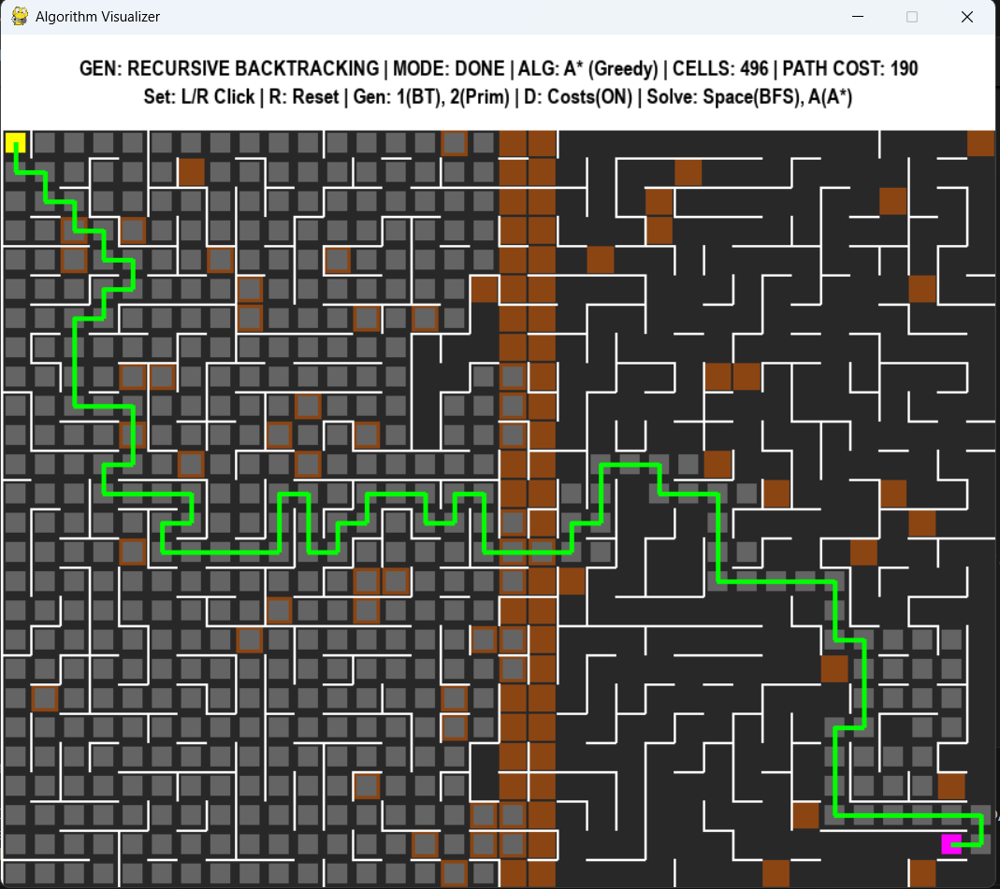

#  Pathfinding Visualizer

A Python application that visualizes how different algorithms solve mazes.

I built this to understand the difference between **Breadth-First Search (BFS)** and **A* Search**, specifically how they handle obstacles and terrain costs (like rivers or mud).

<p align="center">
  
</p>

## 🎮 How it Works

This tool simulates a "robot" trying to get from Point A (Yellow) to Point B (Magenta).
* **The Maze:** Generated randomly using Recursive Backtracking, then modified to have loops so there are multiple paths to choose from.
* **The Algorithms:**
    * **BFS:** Explores everywhere evenly. It guarantees the shortest path but is slow.
    * **A* (A-Star):** Uses a "smart" heuristic to guess where the goal is. It is much faster and creates a direct path.

## 🛠️ Controls

| Key | Action |
| :--- | :--- |
| **Space** | Run **BFS** (Finds the absolute shortest path) |
| **A** | Run **A*** (Finds the path quickly) |
| **R** | **Reset** with a new maze |
| **D** | Toggle **Terrain Weights** (Turn the river On/Off) |
| **Left Click** | Start point |
| **Right Click** | End Point |
| **1/2** | select backtrace/Prim Maze |

## 👨‍💻 Tech Stack

* **Language:** Python 3.12
* **Library:** Pygame (for the 60 FPS visualization)
* **Concepts:** Graph Theory, Queues, Priority Queues (Heaps)

## 📦 How to Run

1.  Install Pygame:
    ```bash
    pip install pygame
    ```
2.  Run the code:
    ```bash
    python main.py
    ```
